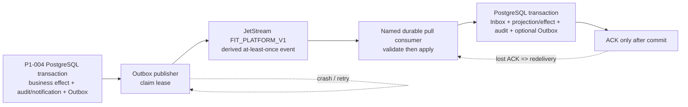

# P1-005 JetStream reliable delivery design

## Status and boundary

- Design baseline: `9b4b113a4032f7f0eee88297781e3b2d069b1f18`.
- This is a design-only handoff for P1-005. It creates neither a service,
  schema, infrastructure configuration, credential, listener, nor production
  capability.
- PostgreSQL is the system of record. JetStream is an authenticated, derived,
  at-least-once delivery transport; it is neither a database, an authorization
  source, nor a recovery source of truth. A broker message, credential, header,
  or subject never grants user or trading-account authority.
- P1 remains development/simulation only. No exchange, signer, wallet, live
  order, deployment, production enablement, or external notification delivery
  is in scope.

## Accepted inputs and deliberately deferred interfaces

P1-005 must start only from the accepted P1-004 descendant. This document uses
the frozen contract names and semantics below, but does **not** define Go DTOs,
SQL columns, retry constants, NATS account tokens, or an unaccepted P1-004 API.
Those are integration inputs, not design authority.

| Dependency | Required accepted interface | P1-005 use | Not to be redefined here |
| --- | --- | --- | --- |
| P1-002 | strict validators; canonical RFC 8785 JCS/SHA-256 payload digest; `EventEnvelope`, `InboxRecord`, `OutboxRecord`, `AuditEvent`, and `Notification` validation | validate before publish and before mutation; preserve canonical bytes/digest | Go type layout, generated mapping, validator internals |
| P1-003 | server-authored identity/ownership context; immutable `AuditIntent` and internal-only `NotificationIntent` | consume only the durable P1-004 result; never obtain authority from NATS | auth/session routes, identity claims, request DTOs |
| P1-004 | one transaction for business effect + immutable audit + notification where required + Outbox; transactional Inbox; aggregate CAS; row-level owner enforcement; nondeleting Outbox | claim/publish/mark lifecycle and consumer transaction | table/column names, repository method names, SQL, lease representation |

Before implementation, P1-005 must record the exact accepted P1-002/003/004
commits and an interface-acceptance matrix. If a required P1-004 method cannot
express the operations below, stop and submit a bounded remediation proposal;
do not add a parallel DTO or change a shared contract.

The frozen contract presently specifies `FIT_PLATFORM_V1`, the exact subjects,
the three principals, per-aggregate ordering, at-least-once delivery, current
plus immediately previous consumer compatibility, and nondeleting Phase 1
Outbox events. It does not freeze numeric values for ack wait, redelivery
backoff, max deliveries, message-size ceiling, JetStream retention duration, or
publisher lease duration. P1-005 may not silently invent durable values. Its
infrastructure bootstrap must make each such value explicit, reviewable,
development-only, and covered by the acceptance tests below; a value change is
a versioned operational compatibility decision, not a message-body change.

## End-to-end delivery model

1. P1-004 atomically writes the authoritative effect, immutable audit record,
   required internal notification record, and an Outbox row containing the
   contract-valid `EventEnvelope`. No publish occurs in that transaction.
2. A publisher claims a pending or expired-lease Outbox record in a short,
   independent PostgreSQL transaction. The claim is conditional: it cannot
   steal a live lease or change the event ID, payload digest, subject, aggregate
   identity/version, or creation time.
3. It publishes the exact contract-valid envelope to its frozen subject and
   waits for a JetStream publish acknowledgement. It then marks the same Outbox
   row `PUBLISHED` in a second conditional PostgreSQL transaction. A crash at
   any point can publish more than once, but cannot create a second
   authoritative business effect.
4. A named durable pull consumer fetches only its preconfigured subject filters.
   It validates message size, envelope schema/version, subject-kind-scope
   binding, RFC 8785 payload digest, and scope before opening its PostgreSQL
   mutation transaction.
5. In one PostgreSQL transaction, the consumer verifies server-authored owner
   scope against the target aggregate, atomically creates/locks its Inbox
   de-duplication record, checks aggregate version and predecessor linkage,
   performs the permitted derived effect, writes its immutable audit record,
   writes any required output Outbox record, and marks the Inbox record
   `APPLIED`. It acknowledges only after that transaction commits.
6. A redelivery finds the existing consumer-scoped Inbox identity and returns
   the saved applied result without repeating the business effect. The same
   `event_id` with a different payload digest is an integrity incident: reject,
   audit/alert by the approved internal path, do not mutate, and do not claim
   successful consumption.

No consumer may acknowledge before durable commit. A failed validation,
wrong-owner delivery, stale or gapped projection, unknown result, or failed
transaction is never an `ACK` success.

## Envelope, digest, ordering, idempotency

The wire body is exactly the accepted `fit.platform.event-envelope.v1`; it is
not a locally reinterpreted DTO. The publisher serializes the exact accepted
payload whose `payload_digest` is SHA-256 over its RFC 8785 JCS bytes. The
consumer recomputes and validates that digest, the durable audit/notification
digest linkage, and equality of outer/inner event identity, subject, kind,
scope, aggregate ID, aggregate version, and `previous_event_id` before any
Inbox insertion or effect.

Ordering is only per aggregate, never global. Version 1 has no
`previous_event_id`; every later version requires the immediately preceding
event ID. In the Inbox transaction, a projection accepts a message only when
the target aggregate's expected version and predecessor equal the envelope.
Duplicates are safe; stale, future, reordered, or predecessor-mismatched
messages are not coerced into order. They remain recoverable/retriable or enter
the reviewed quarantine/reconciliation flow with an immutable audit trail.

The Inbox uniqueness identity is at least `(consumer, event_id)` and binds the
first accepted `payload_digest`; implementation must preserve the frozen
consumer-scoped de-duplication semantics. It is not a replacement for request
idempotency or aggregate CAS. Idempotency protects request/business creation in
P1-003/P1-004; Inbox protects consumer application; aggregate CAS protects
ordering and lost-update prevention. All three are required.

## Streams, consumers, subjects, permissions, and bootstrap boundary

The only application stream is `FIT_PLATFORM_V1`, with the exact 20 subjects
from `contracts/platform/manifests/nats-permissions-v1.json`. P1-005 must load
or mechanically verify this manifest rather than duplicate it in code. The
subject-to-event-kind-to-scope binding is mandatory.

| Runtime principal | Stream role | Allowed application action | Durable pull protocol | Prohibited |
| --- | --- | --- | --- | --- |
| `outbox-publisher` | publish derived Outbox events | publish only every exact manifest application subject; subscribe only to `_INBOX.fit-platform.outbox-publisher.>` for its publish acknowledgements | no consumer configuration | all business subscriptions, all consumer fetch/ack, JetStream administration, user/account claims |
| `platform-consumer` | apply platform projection/effects | no application publish; consume only its exact manifest filters | `PLATFORM_CONSUMER`; exact fetch subject; subscribe only to `_INBOX.fit-platform.platform-consumer.>`; publish ACKs only to `$JS.ACK.FIT_PLATFORM_V1.PLATFORM_CONSUMER.>` | other consumer's filters/inbox/ack prefix, JetStream administration, identity claims |
| `internal-notification-consumer` | apply internal notification handling only | no application publish; consume only exact notification filters | `INTERNAL_NOTIFICATION_CONSUMER`; exact fetch subject; subscribe only to `_INBOX.fit-platform.internal-notification-consumer.>`; publish ACKs only to `$JS.ACK.FIT_PLATFORM_V1.INTERNAL_NOTIFICATION_CONSUMER.>` | platform filters, external delivery, other consumer's prefixes, administration, identity claims |

The only wildcard grants in the whole runtime ACL are the manifest-defined,
per-principal protocol prefixes: publisher subscription to
`_INBOX.fit-platform.outbox-publisher.>`, each consumer subscription to its own
`_INBOX.fit-platform.<consumer>.>`, and each consumer publication to its own
`$JS.ACK.FIT_PLATFORM_V1.<DURABLE>.>`. Every application subject is an exact
literal; `*` and `>` are denied for all application subjects and every other
prefix. The consumer fetch subjects are exact literals. No runtime identity has
`$JS.API.>` or any stream/consumer/account/user administration grant.

The API service has no NATS credential. Runtime credentials name only one of
the three roles and contain no user/account/session/device authority. ACL tests
must reject a foreign protocol inbox, foreign ACK prefix, direct JetStream
administration, publisher subscribe, consumer application publish,
cross-consumer subject access, and every wildcard outside the allowed
protocol-prefix classes.

### One-shot test bootstrap trust boundary

`jetstream-bootstrap` is not a fourth runtime service principal: it is a
test-only, one-shot control-plane identity used solely by the disposable
integration harness before runtime processes start. It has no business subject
publish/subscribe grant, no owner claim, and no ability to apply Inbox effects.
Its complete publish allowlist is exactly these literal JetStream API request
subjects, and no other `$JS.API` subject:

- `$JS.API.STREAM.CREATE.FIT_PLATFORM_V1`
- `$JS.API.STREAM.UPDATE.FIT_PLATFORM_V1`
- `$JS.API.STREAM.INFO.FIT_PLATFORM_V1`
- `$JS.API.CONSUMER.CREATE.FIT_PLATFORM_V1.PLATFORM_CONSUMER`
- `$JS.API.CONSUMER.UPDATE.FIT_PLATFORM_V1.PLATFORM_CONSUMER`
- `$JS.API.CONSUMER.INFO.FIT_PLATFORM_V1.PLATFORM_CONSUMER`
- `$JS.API.CONSUMER.CREATE.FIT_PLATFORM_V1.INTERNAL_NOTIFICATION_CONSUMER`
- `$JS.API.CONSUMER.UPDATE.FIT_PLATFORM_V1.INTERNAL_NOTIFICATION_CONSUMER`
- `$JS.API.CONSUMER.INFO.FIT_PLATFORM_V1.INTERNAL_NOTIFICATION_CONSUMER`

It subscribes only to a dedicated reply-inbox prefix
`_INBOX.fit-platform.jetstream-bootstrap.>` generated per harness run; it has
no business subscription and no broad `_INBOX.>` permission. Its response
capability is limited to `allow_responses` with maximum one response and a
five-second expiry per outstanding bootstrap request, and cannot be used as a
general publish grant. The bootstrap credential is denied stream/consumer
delete, purge, snapshot, restore, account/user management, every other API
subject, `$JS.API.>`, all application subjects, and all other inbox prefixes.
If the NATS control protocol cannot express these exact grants and bounded
response capability, bootstrap must be a local privileged server-start
configuration step inside the disposable harness, not a broader runtime
credential; the exception must be isolated and fail closed in tests.

The harness creates a fresh bootstrap credential immediately before bootstrap,
passes it only to that process through a private ephemeral file/pipe, revokes
or destroys it before starting any runtime process, and removes the artifact at
test teardown. It must never be committed, logged, retained in PostgreSQL or
NATS, put in an application image, mounted into API/publisher/consumer runtime,
or used after bootstrap. The three runtime credentials are minted separately,
least-privilege, short-lived/test-scoped, and cannot create/update stream or
consumer objects. Startup must fail closed if an API or runtime process can
read, dial with, or exercise the bootstrap identity. This proves both lifecycle
separation and that bootstrap trust is not an authority path for runtime data.

## Retry, ACK, quarantine, and flow control

Consumers use explicit acknowledgement with a finite ack wait. On a transient
broker, database, or dependency failure they issue `NAK` with the approved
bounded delay, then allow JetStream's configured bounded backoff/max-deliver
policy to redeliver. They must not busy-loop, ack an unknown state, or let one
poison message stop unrelated healthy subjects. Expiry of a lease, reconnect,
or process restart is treated as retryable delivery, not success.

Before defining broker retention, P1-005 must prove it preserves enough time
for the approved delivery retry and operator recovery window. It must bound
maximum message bytes before publish and before decode; oversized or malformed
messages do not enter an effect transaction. Slow consumers apply bounded pull
batches and in-flight limits; publisher backlog is a pressure signal, not a
license to drop or delete Outbox rows. Database outage, broker partition, and
slow consumption retain the authoritative Outbox and surface backlog/age
metrics.

### DLQ prerequisite acceptance matrix

P1-005 has no independent authority to invent a DLQ record, reuse a business
subject, or republish a failed event. Before any terminal delivery disposition
is enabled, P1-004 must accept a transactionally persisted **non-business
quarantine record plus immutable audit** interface. The interface must bind the
consumer, original received envelope or a bounded forensic representation,
`event_id`, `payload_digest`, subject, aggregate identity/version, delivery
attempt/failure code, and replay state; it must be unique for the consumer and
stable event/digest identity. The same P1-004 transaction records the isolation
fact and audit, and creates no business effect or business Outbox event.

| Failure state | Required P1-004 acceptance before implementation | Persistence and authorization assertion | Broker disposition | Replay assertion |
| --- | --- | --- | --- | --- |
| transient broker/database/dependency failure before consumer commit | ordinary Inbox transaction can roll back completely | no quarantine record; runtime consumer is authorized only for its exact manifest protocol subjects | delayed `NAK`; no `ACK`/`TERM` | ordinary redelivery only |
| consumer crash/unknown before commit | complete rollback is observable | no durable Inbox/effect/quarantine fact | no disposition before crash; redelivery, then delayed `NAK` if still transient | ordinary redelivery only |
| duplicate after prior committed Inbox transaction | accepted Inbox lookup returns the first applied stable event/digest | committed Inbox/audit chain is the only fact; no new owner authority | `ACK` after duplicate verification | no replay required |
| invalid envelope/digest/subject-kind-scope, wrong owner, stale/gapped predecessor, schema drift, or reconciliation-required unknown | transactional quarantine record + immutable audit, with the reason and no business effect | P1-004 validates scope against server-authored target ownership; runtime NATS identity supplies no owner authority | `TERM` only after that isolation transaction commits; otherwise delayed `NAK` | only a reviewed P1-004 replay authorization may release it; never automatic or cross-owner |
| poison/max-deliver exhaustion | same transactional quarantine + audit contract, including bounded delivery metadata | durable isolation fact is unique/idempotent and visible to metrics; no business event is created | `TERM` only after commit; otherwise delayed `NAK` | normal consumer path reads the authorized isolation record and re-executes the same event ID/digest Inbox/CAS checks |
| quarantine persistence/audit transaction fails | P1-004 rollback proof | no successful isolation fact and no authority to stop delivery | delayed `NAK`; never `TERM`/`ACK` | no replay; retry isolation or block for reconciliation |

An unclassified failure is fail closed: it is treated as an unknown pre-commit
state, emits neither `ACK` nor `TERM`, takes delayed `NAK`, creates no
unapproved persistence, and has no replay authorization. It may become terminal
only after a later accepted P1-004 classification supplies the same isolation
and audit guarantees above.

`TERM` means stop delivery to that consumer only after the isolation fact is
durably committed; it does not make JetStream authoritative or erase the source
Outbox. A terminal quarantine is an internal PostgreSQL control-plane fact, not
a new runtime business subject or a second source of truth. The publisher may
publish only P1-004-created Outbox records to existing exact manifest subjects;
it cannot publish from quarantine. The consumer may not call publish during
replay. A reviewed replay worker invokes the same normal consumer application
path with the quarantined original event, preserves the same `event_id` and
`payload_digest`, and repeats normal scope, Inbox, digest, aggregate-CAS, and
audit checks before any effect. Replay authorization must be recorded and
validated by P1-004; a wrong-owner or digest-conflict record can never be
automatically replayed.

If accepted P1-004 interfaces cannot provide the required atomic isolation,
audit, and replay-authorization facts, DLQ/`TERM` and replay are **blocked**.
P1-005 must submit a fail-closed remediation proposal to the P1-004 owner. If
the reviewed remediation chooses broker transport, it must introduce a new
versioned non-business subject and/or stream, a precise new manifest binding,
and the minimum separate principal ACL; it may not reuse any business subject,
broaden runtime wildcard grants, or claim that the capability already exists.

## Publisher lease, reconnection, retention, and replay

The publisher state machine is `PENDING -> CLAIMED -> PUBLISHED`. A claim has a
monotonic expiry and opaque worker identity. Only an atomic conditional claim
may acquire an unclaimed or expired record. Only the claimant that still owns a
valid claim may mark publication; a stale worker's late broker acknowledgement
cannot override a newer claimant. Records are never deleted in Phase 1,
including PUBLISHED records.

The four mandatory crash cuts are: after claim commit/before publish, after
publish/before broker acknowledgement, after acknowledgement/before mark, and
after mark commit. Every recovery path republishes the stable `(event_id,
payload_digest)` only as needed. Derived JetStream data may be discarded and
rebuilt by scanning the complete PostgreSQL Outbox in a deterministic order
that preserves each aggregate's version/predecessor chain. Replay never
invents, deletes, resequences, or turns broker order into authoritative order.

On reconnect, publishers reclaim expired leases and retain stable identity;
consumers resume named durable position, revalidate every redelivered message,
and apply Inbox/CAS. A network partition is an unknown delivery state until
PostgreSQL and the broker outcome are reconciled; no component infers success
from a local timeout.

## Audit, notification, schema compatibility, and observability

Audit events remain immutable PostgreSQL facts created in the same transaction
as each authoritative effect. Broker/infrastructure failures generate only the
accepted internal audit/notification path; they never create an `OWNER` scope
or alter business data. Notification subjects route only the accepted durable
`Notification` records to `internal-notification-consumer`; there is no Email,
Push, webhook, address, destination, or free-form external delivery field.

Consumers must accept the current and immediately previous approved payload
schema revisions. Same-major changes are additive only. An unknown field,
unknown version, invalid scope/kind binding, or DTO drift fails closed before
mutation and becomes a bounded observability/reconciliation event. A breaking
change requires a reviewed new versioned subject and compatibility plan; an old
consumer must not guess a new shape. Contract verifier drift blocks bootstrap
and release.

Structured logs, metrics, and traces use the frozen allowlist and redaction
rules. They may carry bounded correlation/causation IDs, event ID, subject,
consumer, aggregate type/version, delivery attempt, outcome code, and
non-sensitive latency/age. They must not carry credentials, tokens, raw IP,
message bodies, user/account authorization claims, notification destinations,
or unbounded/high-cardinality labels. Minimum measures are Outbox backlog and
oldest age, lease claims/expiry, publish retries/failures, consumer lag,
redelivery/duplicate count, ack/nak/DLQ count, wrong-owner/digest/version
rejects, message-size rejects, schema drift rejects, and
reconciliation-required states. Alerts use bounded codes and route internally.

## Recovery decision table

| Condition | Durable action | Broker action | Required outcome |
| --- | --- | --- | --- |
| publish result timed out or publisher dies | retain/reclaim Outbox record | retry stable event identity | duplicate delivery permitted; no duplicated effect |
| consumer dies before PostgreSQL commit | transaction rolls back | no ACK; redeliver | no Inbox/effect |
| consumer dies after commit before ACK | Inbox/effect are complete | redeliver then ACK duplicate | one effect and one immutable audit chain |
| wrong owner / scope | P1-004 quarantines and audits atomically; no Inbox success/effect | `TERM` after commit, otherwise delayed `NAK` | never ACK success; no automatic cross-owner replay |
| same event ID, different digest | P1-004 quarantines and audits atomically; no mutation | `TERM` after commit, otherwise delayed `NAK` | no success or replay without reviewed reconciliation |
| stale/gapped/predecessor mismatch | P1-004 quarantines and audits atomically; no invalid projection | `TERM` after commit, otherwise delayed `NAK` | no out-of-order effect; replay only after P1-004 authorization |
| poison/exhausted delivery | P1-004 quarantines and audits atomically; no effect unless prior committed Inbox proves duplicate | `TERM` after commit, otherwise delayed `NAK` | healthy work progresses; controlled normal-path replay only |
| quarantine transaction failure | rollback leaves no terminal fact | delayed `NAK`; never `ACK`/`TERM` | no replay until isolation succeeds or remediation resolves |
| broker rebuild | PostgreSQL remains source | rebuild from full Outbox | no invented/dropped authoritative event |

## Implementation handoff gates

P1-005 implementation is ready only when it has: accepted predecessor commits;
an interface-acceptance matrix; an exact development-only, authenticated
bootstrap configuration with reviewed retry/retention/size/lease values; proof
that bootstrap identities are separate from runtime identities; all checklist
evidence; and a fixed-commit independent review. A passing design checklist
does not authorize merge, deployment, production, wallet/exchange access, or
automatic trading.
