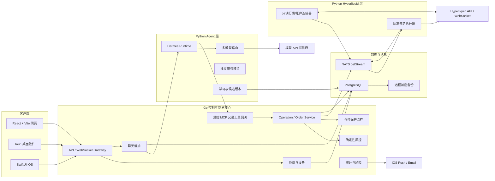
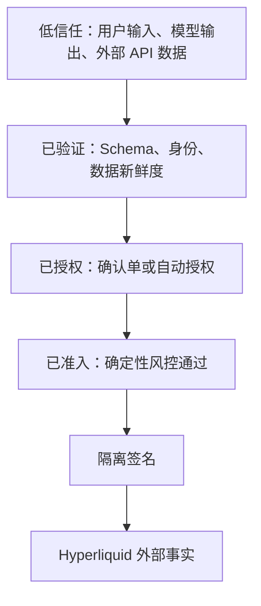
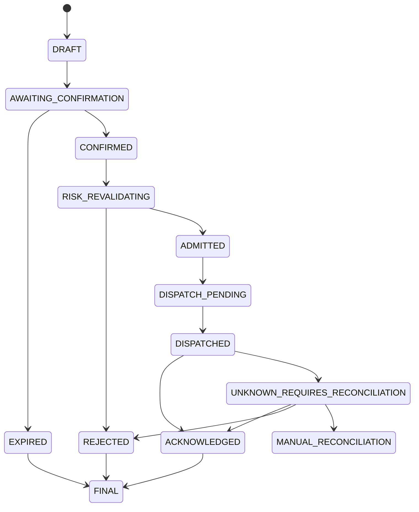
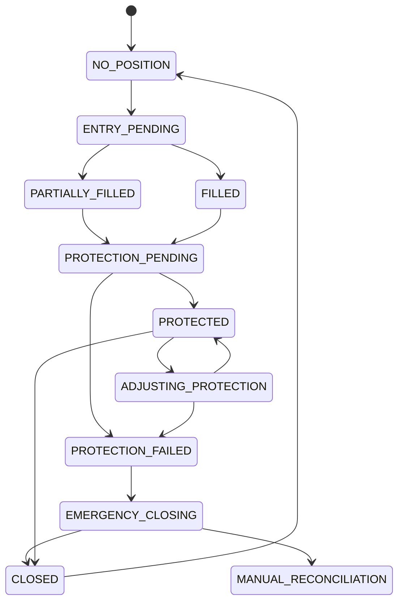
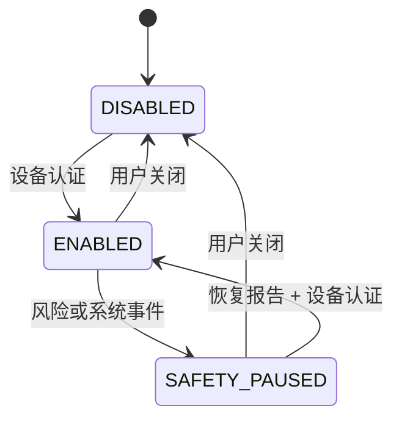
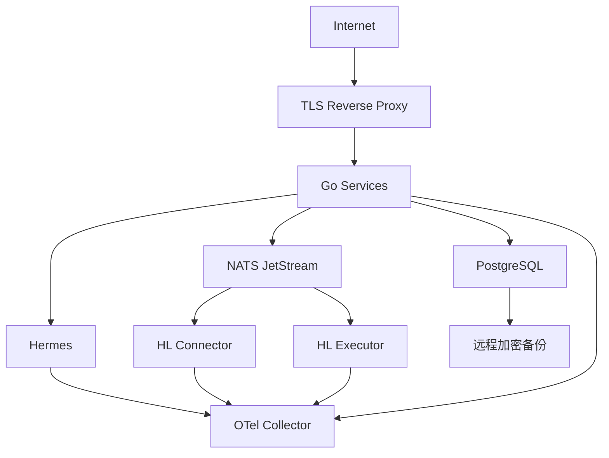

# 系统架构

## 1. 架构目标

系统以真实资金安全和故障恢复为首要目标：

- Agent 只产生结构化意图，不拥有交易权限。
- Go 交易核心是确认、风险、订单状态和审计的唯一协调者。
- Hyperliquid 私钥只存在于隔离的签名执行进程。
- PostgreSQL 是本地交易状态的唯一真相。
- Hyperliquid 是订单、成交和仓位的外部最终事实来源。
- 所有跨服务消息按可能重复设计。
- 网络超时不能被误判为订单失败。
- 任何实际仓位都必须有经过核对的底线止损。

## 2. 总体架构



## 3. 技术栈

| 层 | 技术 | 选择原因 |
| --- | --- | --- |
| 网页 | TypeScript、React、Vite | 高交互 SPA、直接连接 Go API 和 WebSocket |
| 桌面 | Tauri | 复用网页界面、使用系统能力和设备认证 |
| iOS | Swift、SwiftUI | 原生设备认证、Push 和系统集成 |
| 交易核心 | Go | 强类型、并发网络服务、独立二进制和清晰状态机 |
| Hermes | Python | 使用 Hermes 原生运行环境和模型生态 |
| Hyperliquid | Python | 使用官方 SDK，避免自行实现签名细节 |
| 服务协议 | Protobuf/gRPC、MCP、REST、WebSocket | 内部强契约、Agent 工具隔离、客户端兼容 |
| 数据库 | PostgreSQL | 事务、约束、WAL、备份和恢复 |
| 消息 | NATS JetStream | 持久事件、确认、重投和服务解耦 |
| 可观测性 | OpenTelemetry、Prometheus、Grafana | 跨 Go/Python 链路追踪和告警 |
| 部署 | Docker、systemd、Linux | 单节点可重复部署、自动重启和版本回滚 |

Redis 第一版不部署。任何关键状态均不得只存在于内存、缓存或消息系统。

## 4. 服务职责与所有权

### 4.1 Go API Gateway

负责：

- TLS 终止
- 登录、会话和设备上下文
- REST 与客户端 WebSocket
- 请求限速和输入大小限制
- 将客户端身份注入内部请求

不负责：

- 模型推理
- Hyperliquid 签名
- 直接写入适配器状态

### 4.2 Go Operation / Order Service

是以下数据的唯一写入所有者：

- 交易意图
- 确认单
- Operation 和执行尝试
- 订单、成交和仓位投影
- 风险决定
- Inbox/Outbox
- 必需审计事件

它负责：

- 创建不可修改的确认快照
- 消费用户确认
- 确定性风险复核
- 派发执行命令
- 消费执行结果
- 处理未知结果和核对
- 更新本地状态投影

### 4.3 Risk Engine

只使用版本化、确定性的输入：

- 用户风险配置
- 账户权益和可用保证金
- 当前仓位、订单和组合风险
- 入场、止损、杠杆和滑点
- 数据新鲜度
- 白名单和自动授权

模型文本不能成为风险引擎的隐式输入。

### 4.4 Position Protection Monitor

负责：

- 确认每个仓位数量都有 Stop Market 覆盖
- 部分成交后创建或调整止损
- 加仓、减仓、止盈后重新核对覆盖数量
- 识别孤儿止损和无保护仓位
- 保护失败时触发紧急退出

### 4.5 Hermes Runtime

负责：

- 聊天上下文
- 调用模型
- 解释用户意图
- 使用只读市场与账户工具
- 调用 `create_trade_intent`
- 生成复盘与学习候选

Hermes 没有数据库超级用户权限、签名密钥、Shell 到生产主机的权限或 Hyperliquid 执行 API。

### 4.6 MCP 交易工具网关

允许的工具：

- `get_market_snapshot`
- `get_account_state`
- `get_positions`
- `get_open_orders`
- `get_risk_limits`
- `create_trade_intent`
- `request_reduce_position`
- `cancel_entry_order`
- `tighten_stop`
- `submit_trade_feedback`

禁止的工具：

- 原始下单
- 原始签名
- 私钥读取
- 任意 SQL
- 任意 Shell
- 提现和转账
- 修改白名单或风险上限

工具网关从认证会话注入 `user_id` 和 `account_id`。Hermes不能通过参数选择其他用户或账户。

### 4.7 Hyperliquid Connector

无签名密钥，负责：

- 1m K 线、价格、标记价格、预言机价格
- 资金费率、未平仓量和最优买卖价
- 账户权益、仓位、订单和成交
- WebSocket 心跳、重连和订阅恢复
- Info API 周期核对
- 标准化并发布交易所事件

Connector 不直接修改关键业务表。

### 4.8 Hyperliquid Executor

拥有独立 API Wallet 密钥，负责：

- 验证签名请求 Schema
- 二次检查账户、白名单、动作类型和确认绑定
- 管理 nonce
- 使用官方 SDK 签名
- 发送订单、修改、撤单和 `reduce-only` 退出
- 返回原始结果的受控标准化表示

Executor 不接受公网连接，不连接模型 API，不提供通用签名接口。

## 5. 信任边界



任何层都不能跳级：

- 模型输出不能直接变为签名请求。
- 客户端按钮不能直接变为交易所请求。
- 消息队列里的命令不能绕过确认与风控记录。
- Executor 不接受缺少 Operation、确认或自动授权绑定的请求。

## 6. 身份和设备认证

### 6.1 账户密码

账户密码用于登录、新设备和丢失恢复：

- 使用 Argon2id 等内存困难型算法强哈希
- 每用户独立盐
- 登录限速与指数退避
- 异常登录告警
- 会话可撤销
- 密码和哈希不进入日志

### 6.2 设备密码

设备密码由操作系统验证：

- iOS/macOS 使用 LocalAuthentication
- Windows 使用 Windows Hello
- 应用不获取密码或 PIN
- 服务器发送一次性 Challenge
- 设备在本地认证后使用设备绑定密钥签名 Challenge
- 服务器验证签名、动作哈希和有效期

用于：

- 提高风险上限
- 启用或扩大自动交易
- 安全暂停后的恢复

### 6.3 普通交易确认

开仓和加仓只需要已登录、已登记设备点击确认。确认请求仍必须绑定：

- 用户、设备和会话
- 确认单哈希
- 一次性 nonce
- 有效期
- 当前风险和数据版本

## 7. 确认绑定

确认哈希的最小输入包括：

```text
user_id
account_id
network
symbol
side
position_effect
order_type
time_in_force
quantity
notional
margin_mode
leverage
entry_price_or_bound
worst_acceptable_price
stop_type
stop_trigger
take_profit_plan
risk_policy_version
market_snapshot_id
strategy_version
model_version
expires_at
confirmation_nonce
```

采用确定性序列化和加密哈希。确认后任意字段变化都必须生成新哈希和新确认。

## 8. Operation 状态机



关键规则：

- `DISPATCHED` 后超时不能回到 `DISPATCH_PENDING`。
- `UNKNOWN_REQUIRES_RECONCILIATION` 禁止盲目重试。
- 新执行尝试必须使用相同 Operation 和明确的 Attempt 记录。
- 只有核对 `cloid`、`oid`、活动订单、历史订单和成交后才能确定最终状态。

## 9. 订单幂等

### 9.1 ID

- `operation_id`：一次用户或自动策略意图
- `attempt_id`：一次具体派发
- `client_order_id`：映射 Hyperliquid `cloid`
- `exchange_order_id`：Hyperliquid `oid`
- `event_id`：交易所或内部事件

### 9.2 Inbox/Outbox

创建订单和 Outbox 事件在同一 PostgreSQL 事务中完成。

NATS 消费者在同一事务中：

1. 检查 Inbox 是否已处理。
2. 应用状态变更。
3. 写入必需审计。
4. 标记 Inbox。

消息确认只能发生在事务成功之后。重复消息返回既有结果，不产生新订单。

## 10. 市场与账户同步

### 10.1 启动流程

```text
加载品种元数据
→ 获取账户、仓位、活动订单和近期成交快照
→ 建立公共和私有 WebSocket
→ 处理订阅 Snapshot
→ 按 oid/cloid 去重
→ 检查 1m K 线连续性
→ 标记数据 LIVE
```

### 10.2 断线流程

```text
检测连接或心跳失败
→ 标记相关数据 STALE
→ 阻止增加风险
→ 指数退避重连
→ 重取快照
→ 补齐缺失事件
→ 与本地投影核对
→ 一致后恢复 LIVE
```

### 10.3 数据新鲜度

每个市场和账户投影保存：

- `source_timestamp`
- `received_at`
- `sequence_or_event_id`
- `freshness_status`
- `reconciliation_status`

风控读取状态而不是只读取数值。

## 11. K 线和自动判断

- 原始 1m K 线按交易所时间保存。
- 1h、4h 由服务器确定性聚合并进行完整性校验。
- 未收盘 K 线标记 `INCOMPLETE`。
- 自动开仓只读取 `CLOSED_AND_VERIFIED`。
- 每个 `(strategy_version, account_id, symbol, 1h_close_time)` 存在唯一决策键。
- 重启、消息重投和模型重试不得产生第二次正式决策。

## 12. 仓位保护状态机



保护不变量：

```text
protected_size >= absolute_live_position_size
```

替换止损时优先使用原子修改。无法原子修改时，必须避免先删除唯一有效保护。任何不变量破坏都触发最高级别事件。

## 13. 风险引擎

### 13.1 输入

- 版本化风险配置
- 经过核对的账户权益
- 所有实盘仓位和活动订单
- 本次交易意图
- 入场、止损、手续费和滑点
- 全仓或逐仓
- 杠杆和强平价格
- 自动交易授权
- 数据新鲜度与系统健康

### 13.2 确定性计算

```text
risk_budget = account_equity * configured_trade_risk
price_risk = position_size * abs(entry_price - stop_price)
execution_cost = estimated_fees + slippage_budget
estimated_loss = price_risk + execution_cost
```

实际实现必须按 Hyperliquid 合约和精度规则计算，不能直接使用浮点数；金额、价格和数量使用定点十进制。

### 13.3 拒绝条件

- 非白名单品种
- 数据过期或未核对
- 缺少 Stop Market
- 杠杆未指定或超限
- 止损在强平之后或安全距离不足
- 超过单笔、组合、日/周或连续亏损限制
- 自动交易授权不匹配
- 当前仓位未受保护
- 存在未解决的未知订单结果
- Kill Switch 或安全暂停

## 14. 自动交易架构

### 14.1 授权对象

`AutomationGrant` 包含：

- 用户和账户
- 策略、风格模型和审核模型版本
- 允许品种
- 每币种杠杆
- 风险策略版本
- 资金和仓位上限
- 允许订单和仓位管理动作
- 授权哈希
- 状态

### 14.2 状态机



`SAFETY_PAUSED` 期间：

- 禁止新开仓和加仓
- 允许收紧止损、减仓、止盈和平仓
- 继续同步真实账户
- 不自动恢复

### 14.3 双模型

自动开仓流程：

```text
交易模型生成结构化 Proposal
→ Schema 验证
→ 独立审核模型审核
→ 审核 Schema 验证
→ 两者模型/提示词版本固定
→ Go 确定性风控
→ AutomationGrant 校验
→ 执行
```

任一模型不可用或意见不通过时记录 `NO_TRADE`。

## 15. 学习架构

### 15.1 Trade Episode

一次完整交易形成 `TradeEpisode`：

- 交易前市场快照
- 用户原始指令和理由
- Hermes 解释
- 确认快照
- 风险决定
- 订单、成交和仓位管理事件
- 退出结果
- 费用、资金费和滑点
- 自动复盘
- 用户反馈
- `training_eligible`

### 15.2 数据边界

- 普通聊天默认 `training_eligible=false`
- 确认交易和明确反馈才可设置为 true
- 用户可以纠正、撤回和删除
- 删除后必须从下一候选训练集排除
- 训练集使用事件发生时可获得的数据，禁止未来数据泄漏

### 15.3 版本

候选版本不可变，包含：

- 数据集清单和哈希
- 特征和指标版本
- 模型和提示词
- 训练参数
- 验证窗口
- 影子结果
- 风险指标
- 用户批准

## 16. 数据模型

核心实体：

```text
User
Device
Session
TradingAccount
ExchangeCredentialReference
Instrument
MarketCandle
MarketSnapshot
RiskPolicy
TradeIntent
Confirmation
Operation
ExecutionAttempt
Order
Fill
PositionProjection
ProtectionOrder
AutomationGrant
AutomationDecision
Conversation
TradeEpisode
StrategyVersion
ModelRouteVersion
Inbox
Outbox
AuditEvent
Notification
```

所有业务实体必须带明确的 `user_id` 和 `account_id`，或通过不可绕过的外键关系归属用户。

## 17. 密钥与签名

### 17.1 钱包结构

```text
主钱包
→ 手动转入有限资金
→ 独立 Hyperliquid 交易钱包
→ 授权专用 API Wallet
→ Executor 使用 API Wallet 签名
```

### 17.2 存储

- 主钱包私钥不进入系统。
- API Wallet 密钥加密保存，密文和解封权限分离。
- Executor 启动时按最小权限解封到进程内存。
- 密钥不写入数据库业务表、容器镜像、环境输出或日志。
- 轮换后不复用旧 API Wallet 地址。

### 17.3 Executor 二次策略

Executor 在签名前拒绝：

- 非 BTC/ETH/SOL
- 非预期网络或账户
- 未允许的 Action
- 缺少确认/自动授权绑定
- 超出数量、杠杆、价格或风险边界
- nonce 异常或请求过期
- 重复 Attempt

## 18. 部署拓扑

初始单服务器：



网络规则：

- 只暴露客户端所需的 HTTPS/WSS。
- PostgreSQL、NATS、Hermes、Connector 和 Executor 不暴露公网。
- Executor 仅允许访问 Hyperliquid 端点、内部 NATS/mTLS 入口和必要的密钥服务。
- 生产 SSH 使用密钥、最小来源范围和审计。

## 19. 备份与恢复

### 19.1 备份

- PostgreSQL 持续 WAL 归档到远程加密存储
- 周期基础备份
- 配置、Schema、镜像清单和部署脚本版本化
- 备份完整性和恢复演练
- 密钥备份与数据库备份分离

### 19.2 恢复

```text
重建 Linux 主机
→ 恢复固定版本服务
→ 恢复 PostgreSQL 到目标时间点
→ 恢复 NATS 或从 Outbox 重放
→ 保持交易写入关闭
→ 查询 Hyperliquid 真实账户
→ 核对订单、成交、仓位和止损
→ 处理差异
→ 用户确认后恢复增加风险
```

由于初始没有热备，RPO 1 分钟、RTO 15 分钟是目标而非保证。

## 20. 发布和回滚

- 服务使用不可变镜像和精确依赖锁定。
- 数据库迁移采用向前兼容的 expand/contract。
- 发布前验证旧客户端与新 API 的兼容窗口。
- Executor 和交易核心不得同时进行不兼容升级。
- 回滚不能删除或倒退已发生的真实交易事实。
- 回滚后必须重新核对 Hyperliquid。
- 自动交易在高风险升级期间保持禁用，升级后需人工恢复。

## 21. 可观测性和告警

关键指标：

- `market_data_age`
- `private_stream_age`
- `reconciliation_lag`
- `unknown_operation_count`
- `unprotected_position_size`
- `order_submit_latency`
- `signing_error_count`
- `nats_redelivery_count`
- `idempotency_hit_count`
- `database_wal_archive_age`
- `backup_restore_test_age`
- `model_schema_failure_count`
- `automation_pause_count`

`unprotected_position_size > 0`、未知订单长时间未解决、WAL 归档中断和 Executor 权限异常必须产生最高级别告警。
