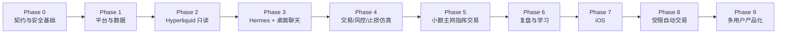

# 开发阶段计划

## 1. 计划原则

- 建设完整产品架构，但按风险依赖顺序交付。
- 先证明只读事实和状态恢复，再开放任何写入。
- 先完成用户指挥与确认交易，再建设自动交易。
- 网页/桌面优先，iOS 在核心链路稳定后开发。
- 用户选择直接小额主网，不取消本地仿真、契约测试、故障注入和主网只读验证。
- 每个阶段的通过只授权进入下一开发阶段，不自动授权部署、扩大资金或自动实盘。

## 2. 阶段总览

## 3. Phase 0：契约与安全基础

### 3.1 目标

在写业务实现前冻结跨语言契约、状态机、权限和失败语义。

### 3.2 产物

- Protobuf/gRPC 契约
- MCP 工具 Schema
- REST/OpenAPI 和客户端 WebSocket 事件
- TradeIntent、Confirmation、Operation、Order、Fill、Position Schema
- 风险配置 Schema
- AutomationGrant 和模型 Proposal/Review Schema
- 审计事件 Schema
- 错误码与可重试分类
- 确认哈希规范
- 威胁模型和秘密管理方案
- 本地 Fake Hyperliquid 与故障注入器

### 3.3 退出条件

- Go 和 Python 同时编译/验证同一契约
- 所有 Schema 有正向、缺失字段、未知字段、越界和恶意输入测试
- 状态机拒绝非法迁移
- MCP 无原始签名、提现、SQL 和 Shell
- 确认哈希对每个风险字段突变敏感
- 秘密扫描和日志脱敏基线通过

## 4. Phase 1：平台与数据基础

### 4.1 目标

建立不会丢失关键状态的 Go、PostgreSQL 和 NATS 基础。

### 4.2 产物

- Go API Gateway
- 用户、设备、会话和所有权模型
- PostgreSQL 迁移
- Operation/Order 数据模型
- Inbox/Outbox
- NATS JetStream
- 审计与通知骨架
- OpenTelemetry
- Docker/systemd 本地和服务器部署骨架
- WAL 归档和恢复脚本

### 4.3 退出条件

- 重复消息不产生重复业务效果
- 服务在任意事务点崩溃后可恢复
- 用户隔离突变测试通过
- 会话撤销和设备 Challenge 通过
- 时间点恢复演练成功
- RPO/RTO 开始以实测记录，不使用推测值

## 5. Phase 2：Hyperliquid 只读连接

### 5.1 目标

在没有签名和下单权限的情况下证明真实市场、账户和恢复链路。

### 5.2 产物

- Python Hyperliquid Connector
- BTC、ETH、SOL 元数据与精度
- 1m K 线、1h/4h 聚合
- 价格、标记价、预言机价、资金费率、未平仓量和 BBO
- 账户、仓位、订单和成交同步
- WebSocket 心跳与重连
- Info API 核对
- Go 端市场和账户投影
- 数据状态和告警

### 5.3 退出条件

- 持续只读运行期间无未解释缺口
- 断网、乱序、重复和重启后重新一致
- 用户在 Hyperliquid 原生界面手工操作后能够检测并同步
- 未收盘 K 线不会被标记为正式自动信号输入
- 非白名单和现货数据不会进入实盘路径

## 6. Phase 3：Hermes 与网页/桌面只读体验

### 6.1 目标

完成内置聊天、完整图表和只读交易上下文，不开放签名。

### 6.2 产物

- React/Vite 网页终端
- Tauri 桌面包装
- 内置 Hermes 流式聊天
- MCP 只读工具
- 多模型路由
- 账户、仓位、订单和盈亏页面
- 1h/4h 图表、画线和 Hermes 分析叠加
- 软件内通知和 Email 骨架

### 6.3 退出条件

- Hermes无法访问未授权工具
- Prompt Injection 不能获得秘密或修改风险
- 客户端只显示服务器权威状态
- `LIVE/STALE/RECONCILING` 清楚可见
- 模型切换不影响既有会话事实和结构化对象

## 7. Phase 4：交易、确认、风控和止损仿真

### 7.1 目标

使用 Fake Hyperliquid 完整证明写入链路，不接真实签名密钥。

### 7.2 产物

- 交易意图和确认卡
- 普通点击确认与设备认证
- 确定性 Risk Engine
- 市价 IOC、GTC、ALO
- `cloid` 和未知结果核对
- 独立 Executor 接口
- Position Protection Monitor
- Stop Market、止盈和移动止损
- Kill Switch
- Push/Email 关键告警

### 7.3 必测故障

- 重复确认
- NATS 重投
- Executor 在签名前、签名后、提交后和回报前崩溃
- 下单成功但响应丢失
- 部分成交后父订单取消
- 止损创建和修改失败
- 数据库重启
- WebSocket 断线
- 客户端断线后重复提交

### 7.4 退出条件

- [功能与验收标准](03_FUNCTIONAL_ACCEPTANCE.md) 中 AUTH、TRADE、ORDER、RISK、PROTECT、SEC 相关项通过
- 无重复订单效果
- 所有非零仓位都满足保护不变量
- 保护失败能够自动紧急退出
- 未知结果在核对前不能重试
- Kill Switch 和安全暂停可验证

## 8. Phase 5：小额 Hyperliquid 主网指挥交易

### 8.1 目标

按用户选择，不把 Testnet 作为强制前置；在完整本地验证和主网只读验证之后，以明确的一次性授权进行小额主网指挥交易。

### 8.2 前置授权

进入本阶段前必须由用户明确指定：

- 独立交易钱包
- 初始资金上限
- API Wallet
- BTC、ETH、SOL 子集
- 单笔和总风险
- 每币种最大杠杆
- 滑点上限
- 首次允许的具体动作与执行窗口

文档基线本身不构成该授权。

### 8.3 执行顺序

1. 主网只读核对。
2. API Wallet 权限与撤销路径验证。
3. 小额 GTC/ALO 挂单与撤单。
4. 小额市价 IOC。
5. 部分成交处理。
6. Stop Market 创建、收紧和触发。
7. `reduce-only` 减仓和平仓。
8. 小额保护失败演练仅使用安全仿真，不故意暴露真实仓位。

### 8.4 退出条件

- 每次执行都有 Confirmation、Operation、Attempt、Order、Fill 和审计链
- 交易所真实状态与本地状态一致
- 止损保护被独立查询确认
- 实际费用和滑点进入复盘
- 没有高严重度未解决问题
- 扩大资金前获得新的用户授权

## 9. Phase 6：复盘、学习和候选版本

### 9.1 目标

形成可追溯、可纠正、不会在线自我修改的学习闭环。

### 9.2 产物

- 交易前理由和结构化标签
- TradeEpisode
- 自动复盘
- 用户反馈和删除
- 风格模型版本
- 改进研究模型版本
- 时间隔离的历史回放
- 影子运行
- 候选版本比较和批准

### 9.3 退出条件

- 普通聊天不会误入训练集
- 删除/撤回能从候选数据集排除
- 不存在未来数据泄漏
- 盈利不自动等于正确、亏损不自动等于错误
- 未批准候选无法被实盘路由引用
- 旧版本可回滚

## 10. Phase 7：原生 iOS

### 10.1 目标

在核心链路稳定后提供原生移动体验。

### 10.2 产物

- SwiftUI App
- 登录和设备登记
- 内置聊天
- 账户、仓位、订单和图表
- 结构化确认卡
- 设备密码认证
- iOS Push
- Kill Switch
- 与网页/桌面会话和状态同步

### 10.3 退出条件

- 后台/前台切换不重复确认或下单
- Push 点击不能绕过登录和权限
- 设备密码仅由系统处理
- 丢失设备会话可撤销
- iOS、网页和桌面状态一致

## 11. Phase 8：受限自动交易

### 11.1 目标

只让已批准、达到门槛的版本在固定授权内自动运行。

### 11.2 产物

- AutomationGrant
- 1h 唯一决策
- 4h 方向上下文
- 交易模型和独立审核模型
- `NO_TRADE` 记录
- 自动仓位管理
- 风险暂停和设备认证恢复
- 自动版本回滚

### 11.3 前置条件

- 已有足够用户确认的 TradeEpisode
- 用户设置最少样本和影子周期
- 候选满足风险和一致性门槛
- 独立审核模型稳定
- 用户明确批准具体模型、策略、品种、杠杆、资金和风险

### 11.4 退出条件

- 同一 1h K 线不会重复决策
- 任一模型失败时不新开仓
- 自动策略不能扩大授权或放宽止损
- 达到风险条件后暂停
- 条件恢复不会自动继续
- 所有自动决定包括 `NO_TRADE` 可追溯

## 12. Phase 9：多用户产品化

不属于当前实现授权。未来进入前需重新评估：

- Passkey、多因素认证和账户恢复
- 租户级密钥隔离
- 每用户 API Wallet 和执行进程
- 配额、限频和费用
- 隐私、条款和合规
- 多服务器高可用
- 商业监控与支持

个人版不得用全局单例账户、全局 API Key 或缺少 `user_id` 的数据表，为本阶段制造重写障碍。

## 13. 工作流拆分

建议独立工作流：

| 工作流 | 主要所有权 |
| --- | --- |
| W0 契约与安全 | Schema、确认哈希、威胁模型、秘密策略 |
| W1 Go 平台 | 身份、Operation、Risk、Audit、API |
| W2 Hyperliquid | Connector、Executor、精度、核对 |
| W3 Hermes | Agent Runtime、MCP、模型路由、学习 |
| W4 客户端 | React/Vite、Tauri、图表、确认卡 |
| W5 iOS | SwiftUI、设备认证、Push |
| W6 可靠性 | PostgreSQL、NATS、备份、监控、部署 |
| W7 验证 | Fake Exchange、故障注入、主网只读与退出审核 |

高耦合文件和契约必须由一个集成负责人统一管理，避免 Go、Python 和客户端各自定义不兼容的交易语义。

## 14. 版本与发布策略

- `main` 只接受已通过当前阶段门槛的变更。
- 每个发布保存源代码提交、镜像摘要、迁移版本和契约哈希。
- 签名执行器单独发布和回滚。
- 数据库迁移先兼容旧版本，再切换流量，最后清理旧字段。
- 高风险版本升级时自动交易保持关闭。
- 发布后先只读核对，再恢复增加风险。

## 15. 回滚边界

可以回滚：

- 客户端
- Hermes 模型路由
- 未启用的候选策略
- Go/Python 服务的兼容版本

不能通过代码回滚撤销：

- 已提交的 Hyperliquid 订单
- 已发生的成交
- 已使用的 nonce
- 已发出的风险和审计事实

任何回滚完成后都必须重新查询 Hyperliquid 并重建本地投影。

## 16. 下一阶段开始条件

开始实现前还需要一次明确的开发授权，至少确认：

- 允许创建代码与依赖
- 允许的工作区和 Git 分支
- 是否允许安装项目级工具
- 第一阶段的完成定义

连接真实钱包、部署服务器和执行主网订单需要分别的新授权，不能由开发授权推导。
