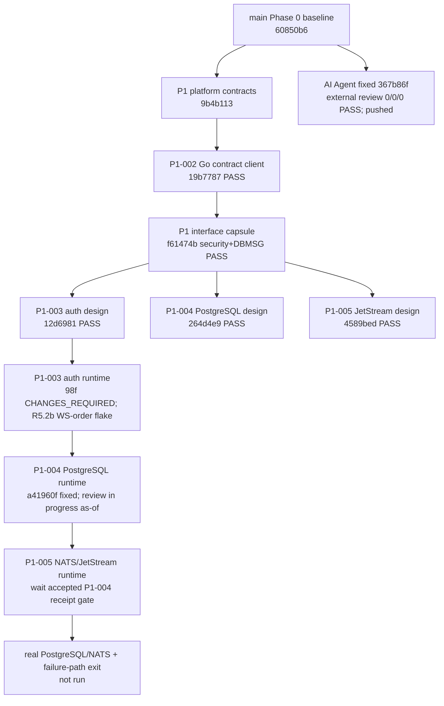

# 项目代码地图

更新日期：2026-07-29
证据截止时间（as-of）：`2026-07-29T18:05:21-07:00`
地图快照：`codex/round-3-progress-docs`，基于
`codex/round-2-progress-docs@91af7813d77190ed4b2a943411888d406fc146e2`

## 1. 仓库结构与权威边界

```text
FIT-Trade/
├── contracts/                    跨语言契约、安全规则、fixture 与验证器
├── services/
│   ├── trading-core/             Go 领域、P1 契约消费端和未来平台 runtime
│   ├── hermes-agent/             Python Hermes 契约/安全一致性与未来 Agent runtime
│   └── hyperliquid-adapter/      尚未实现；未来只读适配器位置
├── prototype/web-desktop/        React/Vite Command Center 原型（本地模拟）
├── docs/                         产品、架构、验收、状态和代码地图
└── coordination/                 任务包、设计 capsule 与固定审查证据
```

| 区域 | 当前权威事实 | 所有者 / 修改边界 |
| --- | --- | --- |
| `contracts/` | Phase 0 共用交易契约；P1 platform contract 在未合并分支 `codex/p1-platform-contracts@9b4b113` | 本地协调者；其他工作项只能消费，不能自行重定义 |
| `services/trading-core/platformcontract/` | P1-002 严格、只读 Go contract consumer 候选 `19b7787`；无 HTTP、认证存储、DB、NATS、签名、钱包或网络写入 | server P1-002；后续 P1-003/004/005 只消费其类型/语义 |
| `services/trading-core/{api,auth,session,ownership}/` | P1-003 auth core 候选 `98f` 审查为 `CHANGES_REQUIRED` P1；R5.2b full gate 发现 WebSocket 顺序 flake，截至 as-of 未接受/未推送 | server Codex；只可同范围修复、固定并复审；不得触及 `contracts/` 或共享文档 |
| `services/trading-core/persistence/`、`infra/postgres/` | P1-004 R5.4 固定候选 `a41960ff98a8b3be7b82e31f06c89ccb085c2593` 已通过 pre/full/race/真实 disposable PostgreSQL gates 和 mechanical amend；截至 as-of 独立 review 进行中，未接受/未推送 | server Codex；须以 P1-003 已接受对象为输入；gates/fixed commit 不替代独立审查 |
| `services/hermes-agent/` | AI Agent `367b86f` 已获外部 fixed-review `P0/P1/P2=0/0/0 PASS`，隔离分支已推送未合并；Phase 3 runtime/security exit 仍未完成 | 本地 Hermes 开发 profile；不得把该对象外推为完整 Phase 3 或安全执行 PASS |
| `prototype/web-desktop/` | Command Center 模拟原型；不连接真实 API、钱包、签名器、交易所或生产后端 | 本地协调者；模拟状态不能成为服务端权威 |
| `coordination/design/` | P1 interface capsule 与 P1-003/004/005 设计为未合并、已推送的固定文档对象 | 各设计工作项产出；协调者登记、审查和集成 |

## 2. 分支、提交与工作树账本

“工作树”记录的是本快照能定位的工作位置；判定一律以表中的 40 位固定 commit
为准，而不是移动的工作树 `HEAD` 或未提交文件。

| 工作项 | 分支 / 固定 commit | 工作树（本快照） | 模块所有权 | 状态 |
| --- | --- | --- | --- | --- |
| P1 platform contracts | `codex/p1-platform-contracts` / `9b4b113a4032f7f0eee88297781e3b2d069b1f18` | `/Users/guanlan/Documents/FIT-Trade-worktrees/p1-platform-contracts` | `contracts/platform/**` | 已推送、未合并；先前已审查 |
| P1-002 Go client | `codex/p1-go-contract-client` / `19b778785565d31dc095996ce4d4b0f7d58bebdf` | 执行/审查位置：`/Users/guanlan/Documents/FIT-Trade-worktrees/p1-go-contract-client-{probe,review}`；两者当前不代表候选 HEAD | `services/trading-core/platformcontract/**` | 已推送；独立 `0/0/0 PASS` |
| interface capsule | `codex/p1-interface-capsule` / `f61474ba4f96624f34ff478bd0047c28e72becab` | `/Users/guanlan/Documents/FIT-Trade-worktrees/p1-interface-capsule` | `coordination/design/P1-INTERFACE-CAPSULE/**` | 已推送；security + DBMSG 双 `PASS` |
| P1-003 design | `codex/p1-003-design-r2` / `12d698181ae88cadbfaf42a9dce6107585c432b7` | `/Users/guanlan/.codex/worktrees/3bd9/交易所适配器` | `coordination/design/P1-003/**` | 已推送；`PASS` |
| P1-004 design | `codex/p1-004-postgres-design-r2` / `264d4e943565a74039d0b74583bb0404b695d378` | `/Users/guanlan/.codex/worktrees/47ce/交易所适配器`（detached） | `coordination/design/P1-004/**` | 已推送；`PASS` |
| P1-005 design | `codex/p1-005-jetstream-design` / `4589bed3f7f9287751a5c57db311a1373597a67f` | `/Users/guanlan/.codex/worktrees/5a18/交易所适配器` | `coordination/design/P1-005/**` | 已推送；`PASS` |
| AI Agent / Hermes | `codex/ai-agent-swarm-bootstrap` / `367b86f94f855ddc7673997b0b455f5b0908f04f` | `/Users/guanlan/Documents/FIT-Trade-worktrees/ai-agent-swarm-bootstrap` | `services/hermes-agent/**` 与 AI coordination 资料 | 已推送、未合并；外部 fixed-review `P0/P1/P2=0/0/0 PASS` |
| P1-003 auth runtime | `codex/p1-go-api-auth` / 候选 `98f`，R5.2b 尚无已接受对象 | `/root/fit-trade-dev/worktrees/p1-go-api-auth` | `services/trading-core/{api,auth,session,ownership}/**` | `CHANGES_REQUIRED` P1；R5.2b full gate 发现 WebSocket 顺序 flake，截至 as-of 未接受/未推送 |
| P1-004 PostgreSQL runtime | `codex/p1-postgres-persistence` / `a41960ff98a8b3be7b82e31f06c89ccb085c2593` | `/root/fit-trade-dev/worktrees/p1-postgres-persistence` | `services/trading-core/persistence/**`、`infra/postgres/**` | pre/full/race/真实 PostgreSQL gates 与 mechanical amend 已完成；截至 as-of 独立 review 进行中，未接受/未推送 |
| P1-005 JetStream runtime | 尚未建立运行时候选 | 待 P1-004 receipt gate 后指定 | `services/trading-core/` 的 Outbox consumer 与 JetStream 适配路径 | 等待已接受的 P1-004 receipt gate；不得启动 runtime 结论 |

所有表中“已推送”仅指功能分支已存在于 `origin`；`main` 没有合并这些对象。

`docs/CURRENT_STATUS.md` 的 `PROGRESS_UNITS_V1` 与 `PROGRESS_SUBGROUPS_V1` 是本
地图使用的唯一进度口径：`ALL=4/25=16.0%`、`P1_DESIGN_CONTRACT=3/3=100.0%`，
完整 Phase 1 为 `P1=3/7=42.9%`，`P1_RUNTIME_RECOVERY_EXIT=0/4=0.0%`。AI `367b86f`
只关闭 provenance fixed-review，未满足 P3-U01 的完整产物/acceptance，故不改 25-unit
分子。这些是固定验收单元计数，不是提交数、分支数或工作树数量。

## 3. 依赖 DAG 与集成顺序



规则：P1-003 的运行时只能以已接受 P1-002 为输入；P1-004 只能在 P1-003 有固定、
已审查且已接受的候选后集成；P1-005 只能从已接受 P1-004 的持久 Outbox/receipt
gate 消费。AI Agent `367b86f` 与上述 P1 runtime 不是互相授权关系；其 fixed-review
PASS 不授权 P1 集成、Phase exit、main merge、部署、生产或真实交易。

## 4. 证据与未实现边界

- P1-002 的 `0/0/0 PASS` 适用于 `19b7787`；它不把 Go consumer 变成认证、PostgreSQL
  或 NATS runtime。
- interface capsule 的 security 与 DBMSG 双 `PASS` 只冻结接口和依赖；不会补齐 logout
  contract、交易 domain subjects 或真实基础设施验证。
- 官方 npm 证据仅是带 registry、版本、integrity、命令和时间的固定依赖解析证据；
  本机 cache、无时间戳输出或非官方来源不能充当准入证据。
- `go test -race` 仅覆盖其固定 Go 测试进程；不能证明 DB 事务、NATS、跨进程竞争、
  网络故障或 AI 安全执行。P1-004 R5.4 的 race/真实 PostgreSQL gates 与 fixed candidate
  `a41960ff98a8b3be7b82e31f06c89ccb085c2593` 不会替代截至 as-of 尚在进行的独立
  review；P1-003 `98f` 仍为 `CHANGES_REQUIRED`，且 R5.2b full gate 有 WS 顺序 flake。
- AI Agent `367b86f` 的 provenance 门已是外部 `0/0/0 PASS`，但该 PASS 不代表完整
  AI security execution 或 Phase 3 exit；仍须保留注入、工具越权、确认绕过和未知结果
  的执行证据。

## 5. 下一集成门与风险

1. 在 P1-003 `98f` 同范围补 direct limits/timeouts tests 并修复 R5.2b WebSocket 顺序
   flake，随后固定并独立复审；不得把未推送修改当成完成。
2. 固定交易 Operation、ExecutionAttempt、Order 的 domain subjects；通用 audit subject
   不能代替交易执行 subject。
3. P1-004 R5.4 `a41960ff98a8b3be7b82e31f06c89ccb085c2593` 已完成 mechanical
   amend；等待独立 review 明确结论，真实 PostgreSQL gates 不能自行升级为接受结论。
4. P1-005 等待已接受 P1-004 receipt gate 后，才可在真实 NATS/JetStream 验证顺序、
   去重、重放和恢复；不要用设计 PASS 替代运行时结果。
5. AI Agent `367b86f` 已通过 provenance fixed-review；继续补齐真实 AI security
   execution 和 Phase 3 其余验收，不重开已关闭的 fixed-review 范围。

在每个门产生独立固定提交和审查结论前，禁止将任何分支纳入 `main`，也禁止部署、
生产启用、连接钱包/签名器或真实交易。
