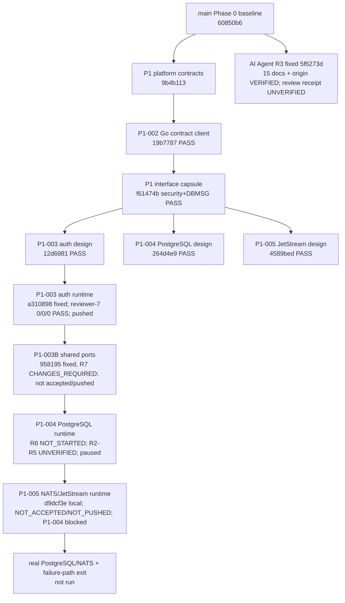

# 项目代码地图

更新日期：2026-07-30
证据截止时间（as-of）：`2026-07-30T06:58:45-07:00`
地图快照：`codex/round-5-progress-docs`，精确基于
`codex/round-4-progress-docs@7f741da4ecb3a1a309a5c884973cb38f7b40b100`
协调状态：`DEVELOPMENT_PAUSED_BY_USER`；active writers=`0`。

## 1. 仓库结构与权威边界

```text
FIT-Trade/
├── contracts/                    跨语言契约、安全规则、fixture 与验证器
├── services/
│   ├── trading-core/             Go 领域、P1 契约消费端和未来平台 runtime
│   ├── hermes-agent/             Python Hermes 契约/安全一致性与未来 Agent runtime
│   └── hyperliquid-adapter/      尚未实现；未来只读适配器位置
├── prototype/web-desktop/        React/Vite Command Center 原型（本地模拟）
├── docs/                         产品、架构、验收、状态和代码地图
└── coordination/                 任务包、设计 capsule 与固定审查证据
```

| 区域 | 当前权威事实 | 所有者 / 修改边界 |
| --- | --- | --- |
| `contracts/` | Phase 0 共用交易契约；P1 platform contract 在未合并分支 `codex/p1-platform-contracts@9b4b113` | 本地协调者；其他工作项只能消费，不能自行重定义 |
| `services/trading-core/platformcontract/` | P1-002 严格、只读 Go contract consumer 候选 `19b7787`；无 HTTP、认证存储、DB、NATS、签名、钱包或网络写入 | server P1-002；后续 P1-003/004/005 只消费其类型/语义 |
| `services/trading-core/{api,auth,session,ownership}/` | P1-003 auth core `a3108988463e9b373b8263fb3f060f8908c54c82`（parent `19b778785565d31dc095996ce4d4b0f7d58bebdf`）获 reviewer-7 `P0/P1/P2=0/0/0 PASS`；`origin/codex/p1-003-auth-core` 已核验、未合并 | server Codex；该 fixed-review 满足 P1-004 的 P1-003 接受前置，但不重写 `contracts/`、共享文档或授权发布 |
| `services/trading-core/workflowport/` | P1-003B fixed `958195ad2fde646c3c956ef42c734b1175d6f154`（parent `a3108988463e9b373b8263fb3f060f8908c54c82`、tree `cc87858aadfdd053fec587a13de8e779b44fd4f7`）只新增 35 个 workflow-port 路径；`SERVER_EXTERNAL_EVIDENCE` 支持 isolated code gates mostly pass，但 R7 artifact gate `CHANGES_REQUIRED` | server Codex；未 accepted/pushed，第三次官方下载未授权且已取消；不得由 persistence 消费或重定义 |
| `services/trading-core/persistence/`、`infra/postgres/` | P1-004 R6 `NOT_STARTED`；只等待 accepted P1-003B，旧 `a41960ff98a8b3be7b82e31f06c89ccb085c2593` 未触碰。PG16 preflight 与 R6 分离 | R2—R5 均 `CHANGES_REQUIRED`、`OVERALL=UNVERIFIED`；R5 仅固定 `FAIL_CLOSED_RC=2`，具体原因、后续 gate 与 cleanup 均 `UNVERIFIED`；用户暂停后 active writer=`0` |
| `services/hermes-agent/` | AI Agent R3 `5f6273d5b7e1661460e2aa8c29cb73eeeb3d623e`（parent main `60850b69dd06c46bbe2a9cfab19d27cdb2ef0412`）为 15 add-only docs，origin 已推送未合并；这些 Git 事实 `VERIFIED` | 独立 review durable receipt unavailable/`UNVERIFIED`；不得声称 auditable `0/0/0 PASS` 或完整 Phase 3 exit |
| `prototype/web-desktop/` | Command Center 模拟原型；不连接真实 API、钱包、签名器、交易所或生产后端 | 本地协调者；模拟状态不能成为服务端权威 |
| `coordination/design/` | P1 interface capsule 与 P1-003/004/005 设计为未合并、已推送的固定文档对象 | 各设计工作项产出；协调者登记、审查和集成 |

## 2. 分支、提交与工作树账本

“工作树”记录的是本快照能定位的工作位置；判定一律以表中的 40 位固定 commit
为准，而不是移动的工作树 `HEAD` 或未提交文件。

| 工作项 | 分支 / 固定 commit | 工作树（本快照） | 模块所有权 | 状态 |
| --- | --- | --- | --- | --- |
| P1 platform contracts | `codex/p1-platform-contracts` / `9b4b113a4032f7f0eee88297781e3b2d069b1f18` | `/Users/guanlan/Documents/FIT-Trade-worktrees/p1-platform-contracts` | `contracts/platform/**` | 已推送、未合并；先前已审查 |
| P1-002 Go client | `codex/p1-go-contract-client` / `19b778785565d31dc095996ce4d4b0f7d58bebdf` | 执行/审查位置：`/Users/guanlan/Documents/FIT-Trade-worktrees/p1-go-contract-client-{probe,review}`；两者当前不代表候选 HEAD | `services/trading-core/platformcontract/**` | 已推送；独立 `0/0/0 PASS` |
| interface capsule | `codex/p1-interface-capsule` / `f61474ba4f96624f34ff478bd0047c28e72becab` | `/Users/guanlan/Documents/FIT-Trade-worktrees/p1-interface-capsule` | `coordination/design/P1-INTERFACE-CAPSULE/**` | 已推送；security + DBMSG 双 `PASS` |
| P1-003 design | `codex/p1-003-design-r2` / `12d698181ae88cadbfaf42a9dce6107585c432b7` | `/Users/guanlan/.codex/worktrees/3bd9/交易所适配器` | `coordination/design/P1-003/**` | 已推送；`PASS` |
| P1-004 design | `codex/p1-004-postgres-design-r2` / `264d4e943565a74039d0b74583bb0404b695d378` | `/Users/guanlan/.codex/worktrees/47ce/交易所适配器`（detached） | `coordination/design/P1-004/**` | 已推送；`PASS` |
| P1-005 design | `codex/p1-005-jetstream-design` / `4589bed3f7f9287751a5c57db311a1373597a67f` | `/Users/guanlan/.codex/worktrees/5a18/交易所适配器` | `coordination/design/P1-005/**` | 已推送；`PASS` |
| AI Agent / Hermes R3 | `codex/ai-agent-fixed-r3` / `5f6273d5b7e1661460e2aa8c29cb73eeeb3d623e`（parent `60850b69dd06c46bbe2a9cfab19d27cdb2ef0412`） | `/Users/guanlan/Documents/FIT-Trade-worktrees/ai-agent-fixed-r3` | 15 add-only `coordination/{design,evidence}/AI-AGENT/**` docs | origin 精确已推送、未合并；`EXTERNAL_FIXED_REVIEW_RECEIPT_UNAVAILABLE / UNVERIFIED` |
| P1-003 auth runtime | `codex/p1-003-auth-core` / `a3108988463e9b373b8263fb3f060f8908c54c82`（parent `19b778785565d31dc095996ce4d4b0f7d58bebdf`） | 本快照仅核验 Git 固定对象及远端 ref | `services/trading-core/{api,auth,session,ownership}/**` | reviewer-7 `P0/P1/P2=0/0/0 PASS`；已推送、未合并；不自动满足 task-packet acceptance 或 Phase 1 计分 |
| P1-003B shared ports | server-only `codex/p1-003b-shared-ports-clean-r1` / `958195ad2fde646c3c956ef42c734b1175d6f154`（parent `a3108988463e9b373b8263fb3f060f8908c54c82`；tree `cc87858aadfdd053fec587a13de8e779b44fd4f7`） | `/root/fit-trade-dev/worktrees/p1-003b-shared-ports-clean-r1` | `services/trading-core/workflowport/**` | `SERVER_EXTERNAL_EVIDENCE` overall `CHANGES_REQUIRED 0/1/0`；未 accepted/pushed，R7 artifact/residue=0；paths/SHA 见 `CURRENT_STATUS.md` §4 |
| P1-GATE cross-phase T | server-only `codex/p1-gate-crossphase-r1` / `72cf5f5189c9632dbadd08f551592bb1b2a31a90`（parent `a3108988463e9b373b8263fb3f060f8908c54c82`；tree `ba854f0c442d5ff461d899c163563fdfaf941ef1`） | server fixed worktree | `coordination/gates/**`、task/plan/doc routing | `SERVER_EXTERNAL_EVIDENCE` self/full support；overall actual-958 gate `CHANGES_REQUIRED 0/1/0`；未 pushed |
| P1-004 PostgreSQL runtime | `NOT_STARTED`；无 R6 fixed object | active writer=`0`；用户已暂停；旧 `a41960ff98a8b3be7b82e31f06c89ccb085c2593` 未触碰 | `services/trading-core/persistence/**`、`infra/postgres/**` | external R2—R5 均 `CHANGES_REQUIRED`；preflight `OVERALL=UNVERIFIED` |
| P1-005 JetStream runtime | `codex/p1-005-jetstream-runtime@d9dcf3ef2f82cc001023642aa974be23931c445a`；parent `19b778785565d31dc095996ce4d4b0f7d58bebdf`；15 paths | `/Users/guanlan/Documents/FIT-Trade-worktrees/p1-005-jetstream-runtime` | `services/trading-core/` 的 JetStream runtime paths | `NOT_ACCEPTED/NOT_PUSHED/P1-004_INTEGRATION_BLOCKED`；external preflight receipt claims PASS，但绿测/包/preflight 不计 runtime |

所有表中“已推送”仅指功能分支已存在于 `origin`；`main` 没有合并这些对象。

`docs/CURRENT_STATUS.md` 的 `PROGRESS_UNITS_V1` 与 `PROGRESS_SUBGROUPS_V1` 是本
地图使用的唯一进度口径：`ALL=4/25=16.0%`、`P1_DESIGN_CONTRACT=3/3=100.0%`，
完整 Phase 1 为 `P1=3/7=42.9%`，`P1_RUNTIME_RECOVERY_EXIT=0/4=0.0%`。AI R3 `5f6273d`、
P1-005 `d9dcf3e`、P1-003B external isolated gates 与 PostgreSQL/JetStream preflight 都未满足对应 runtime/Phase acceptance，
故不改 25-unit 分子。这些是固定验收单元计数，不是提交数、分支数或工作树数量。

## 3. 依赖 DAG 与集成顺序



规则：P1-003 的运行时只能以已接受 P1-002 为输入；P1-004 必须等 accepted P1-003B shared
ports，而非只依赖 `a310…`。`958195…` 当前受 R7 artifact gate 阻塞；cross-phase T 的
`CHANGES_REQUIRED` 是 offline artifact 缺口，不是 P1-003B 代码失败。PostgreSQL 的 R2—R5
预检均 `CHANGES_REQUIRED`，总体 `OVERALL=UNVERIFIED`；JetStream preflight 是
`SERVER_EXTERNAL_EVIDENCE`。二者都不能替代 P1-004/P1-005 自身 acceptance；本地 `d9dcf3e` 仍只能从已接受 P1-004
的持久 Outbox/receipt gate 消费。AI R3 `5f6273d` 与 P1 runtime 不是互相授权关系；其
review receipt `UNVERIFIED`，更不授权 P1 集成、Phase exit、main merge、部署、生产或真实交易。

## 4. 证据与未实现边界

- P1-002 的 `0/0/0 PASS` 适用于 `19b7787`；它不把 Go consumer 变成认证、PostgreSQL
  或 NATS runtime。
- interface capsule 的 security 与 DBMSG 双 `PASS` 只冻结接口和依赖；不会补齐 logout
  contract、交易 domain subjects 或真实基础设施验证。
- 官方 npm 证据仅是带 registry、版本、integrity、命令和时间的固定依赖解析证据；
  本机 cache、无时间戳输出或非官方来源不能充当准入证据。
- `go test -race` 仅覆盖其固定 Go 测试进程；不能证明 DB 事务、NATS、跨进程竞争、
  网络故障或 AI 安全执行。P1-003B isolated gates、PG partial observations 与 JetStream preflight 不替代 P1-004 R6
  的启动、gate、fixed-commit 或独立 review；R6 当前为 `NOT_STARTED`，且用户暂停后 active writer=`0`。
- AI Agent R3 `5f6273d` 的 object/parent/15 add-only docs/origin ref 已由 Git 核验；独立 review
  durable receipt unavailable/`UNVERIFIED`，不能声称 auditable `0/0/0 PASS` 或 Phase 3 exit。

## 5. 暂停点、下一集成门与风险

当前 `DEVELOPMENT_PAUSED_BY_USER`，没有执行中的 writer 或下一步。恢复后仍遵守：

1. `958195…` 与 cross-phase T 保持未推送、`CHANGES_REQUIRED`；第三次官方网络 intake
   未授权且已取消，恢复后须重新授权。前两次失败均 cleanup/residue=0。
2. P1-004 R6 等待 accepted P1-003B，persistence 不得自造 ports；PG16 preflight R2—R5
   均 `CHANGES_REQUIRED`。R5 只固定 harness `PASS` 与 `FAIL_CLOSED_RC=2`；具体触发点、
   后续 gate 和 cleanup/residue 均 `UNVERIFIED`。恢复后须先产生绑定完整原因、矩阵和
   清理结果的 receipt/manifest，再以 exact digest + `--pull=never` 完整无网重放 +
   独立 receipt verifier 覆盖 DB gate，且不得被登记为 P1-004 runtime。
3. P1-005 本地 fixed candidate `d9dcf3e` 保持 `NOT_ACCEPTED/NOT_PUSHED/P1-004_INTEGRATION_BLOCKED`；
   等待 accepted P1-004 receipt gate，且不得用绿测/包/external preflight 替代 runtime acceptance。
4. AI R3 `5f6273d` 需补齐 durable independent-review receipt；当前只确认 Git object/push，不声称
   auditable `PASS`，并继续等待真实 AI security execution 和 Phase 3 其余验收。

未经用户明确恢复授权，不继续上述工作。在每个门产生独立固定提交和审查结论前，禁止
将任何分支纳入 `main`，也禁止部署、生产启用、连接钱包/签名器或真实交易。
